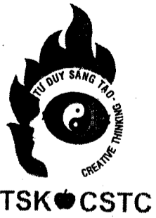
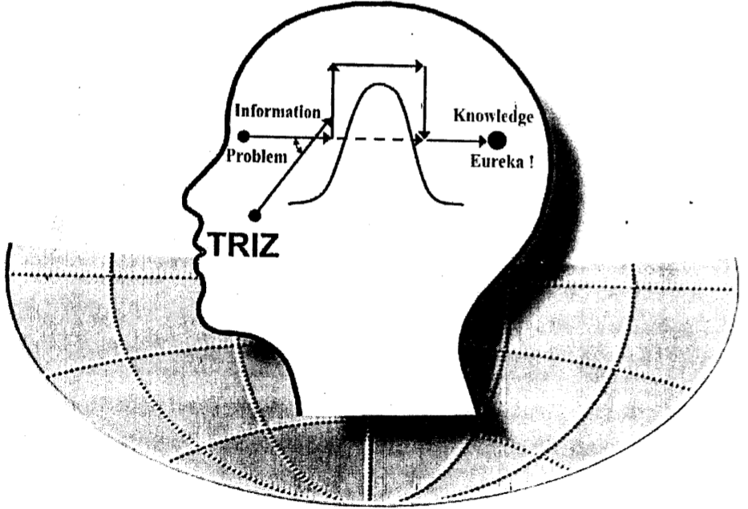
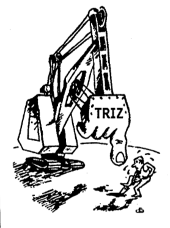

Chương trình môn học "Phương pháp luận sáng tạo và đổi mới, được xây dựng dựa trên nhiều bộ môn khoa học - kĩ thuật, dùng để giải quyết vấn đề và ra quyết định" hay còn gọi tắt là "Phương pháp luận sáng tạo" (PPLST) (120 tiết), gồm chương trình trung cấp (60 tiết).

CHƯƠNG TRÌNH SƠ CẤP PPLST (60 TIẾT)
===================================
[Lời nói đầu](Foreword.md)
-------------
Chương 1: Mở đầu (4 tiết)
-------------------------
Đọc thêm quyển sách "Làm thế nào để sáng tạo", từ trang 2 đến trang 11; từ trang 50 đến hết.

Đọc thêm quyển sách "Phương pháp luận sáng tạo KHKT" từ trang 3 đến trang 12.

1.1. [Một số khái niệm cơ bản](Part-1.1.md)

1.2. [Đối tượng, mục đích, các ích lợi và ý nghĩa môn học PPLST](Part-1.2.md)

1.3. [Khoa học Sáng tạo và phương pháp luận Sáng tạo: Vài nét lịch sử từ Heulistics đến Creatology.](Part-1.3.md)

Chương 2: Phương pháp tự nhiên giải quyết vấn đề và ra quyết định - Tổng quan các cách tiếp cận xây dụng phương pháp luận sáng tạo - TRIZ
---------------------------------------------
Đọc thêm quyển sách “Làm thế nào để sáng tạo”, từ trang 11 đến trang 32.

Đọc thêm quyển sách "Phương pháp luận sáng tạo KHKT”, từ trang 15 đến trang 20, từ trang 71 đến trang 76.

2.1. [Phương pháp thử và sai (3 tiết)](Part-2.1.md)

2.2. [Các ưu và nhược điểm của phương pháp thử và sai.](Part-2.2.md)

2.3. [Tổng quan các cách tiếp cận trong lĩnh vực PPLST](Part-2.3.md)

2.4. [Phân loại các mức sáng tạo và các mức khó của bài toán](Part-2.4.md)

2.5. [[Lý thuyết giải các bài toán sáng chế (TRIZ): Các ý tưởng cơ bản và các nguồn kiến thức](Part-2.5.md)

2.6. Sơ đồ khối lý thuyết giải các bài toán sáng chế (TRIZ)

Chương 3: Một số kiến thức khoa học - kỹ thuật là cơ sở của môn học (15 tiết)
-----------------------------------------------------------------------------
3.1. Từ nhu cầu đến hành động và ngược lại

3.2. Mô hình biến đổi thông tin thành tri thức của quá trình suy nghĩ giải quyết vấn đề và ra quyết định

3.3. Các yếu tố và quá trình tâm lý trong tư duy sáng tạo

3.4. Tính ì tâm lý

3.5. Phép biện chứng và tư duy biện chứng

3.6. Các loại mâu thuẫn trong giải quyết vấn đề và ra quyết định

3.7. Hệ thống và tư duy hệ thống

3.8. Tính ì hệ thống

3.9. Về hai khái niệm: phát minh và sáng chế

3.10. Vai trò và các ích lợi của thông tin Patent trong việc Xây dựng phương pháp luận sáng tạo

Chương 4: Các thủ thuật (nguyên tắc) sáng tạo cơ bản (16 tiết)
--------------------------------------------------------------
4.1 Những điểu cần lưu ý về hệ thống các thủ thuật (nguyên tắc) sáng tạo cơ bản

4.2 Văn bản phát biểu hệ thống các nguyên tắc sáng tạo cơ bản

4.3 Chương trình phát hiện các thủ thuật (nguyên tắc) và làm tái hiện quá trình suy nghĩ để có được đối tượng sáng tạo cho trước

4.4 Bảng các nguyên tắc dùng đế giải quyết các mâu thuẫn kỹ thuật

4.5 Hệ thống các biến đổi mẫu dùng để giải quyết các mâu thuẫn vật lý

4.6 Chương trình rút gọn quá trình suy nghĩ giải quyết vấn đề và ra quyết định

4.7 Từ các nguyên tắc sáng tạo đến các phương pháp sáng tạo

Chương 5: Các phương pháp tích cực hóa tư duy
---------------------------------------------
5.1 Phương pháp đối tượng tiêu điểm (Method of Focal Objects)

5.2 Phương pháp phân tích hình thái (Morphological Analysis)

5.3 Phương pháp các câu hỏi kiểm tra (Method of Control Questions or Check-listing Method)

5.4 Phương pháp não công (Brainstorming Method)

5.5 Synectics - Phương pháp sử dụng các phép tương tự

Chương 6: Các quy luật phát triển hệ thống (10 tiết)
----------------------------------------------------

6.1 Các quy luật phát triển hệ thống

6.2 Cuộc đời của hệ thống

6.3 Sơ đồ về các khả năng phát triển hệ thống

6.4 Các nguyên tắc sáng tạo, các phương pháp: sự thể hiện cụ thể các quy luật phát triển hệ thống

Chương 7: Sơ kết chương trình sơ cấp PPLST
------------------------------------------

7.1 Các nguyên nhân thành công về kinh tế ở thế kỷ 19 và 20

7.2 Nguyên nhân thành công về kinh tế ở thế kỷ 21

7.3 Các thách thức

7.4 Các hệ quả của các thách thức

7.5 Các yêu cầu đặt ra và các việc cần làm để đối phó với các thách thức

7.6 Các kỹ năng mới của tương lai

Chương 8: Vepol và Phân tích Vepol (substance-Field Model and Substance-Field Analysis) (8 tiết)
------------------------------------------------------------------------------------------------
8.1 Bài toán thay đổi hệ và bài toán phát hiện, đo hệ

8.2 Các khái niệm: sản phẩm, công cụ, trường)

8.3 Vepol và phân tích Vepol

8.4 Một số kỷ hiệu dùng trong phân tích Vepol

8.5 Các bài toán có thể nảy sinh nhìn dưới quan điểm Vepol

8.6 Một số điểm lưu ý về Vepol và Phân tích Vepol

Chương 9: Hệ thống các chuẩn (The System of Standard Solutions) (16 tiết)
-------------------------------------------------------------------------
9.1 Các chuẩn loại 1: Dựng và phá các hệ Vepol

9.2 Các chuẩn loại 2: Sự phát triển của các hệ Vepol

9.3 Các chuẩn loại 3: Chuyển sang hệ trên và sang mức vi mô

9.4 Các chuẩn loại 4: Các chuẩn dùng để phát hiện, đo hệ thống

9.5 Các chuẩn loại 5: Các chuẩn dùng để sử dụng các chuẩn

9.6 Chương trình giải bài toán bằng cách sử dụng các chuẩn và luyện tập

9.7 Sơ đồ về sự phát triển của hệ thống các chuẩn

Chương 10: Phương pháp Mô hình hóa Bài toán bằng Những người tí hon - MBN (Problem Modelling with Smart Little People - PMSLP) (8 tiết)
------------------------------------------
10.1 Phép tương tự cá nhân: các ưu và nhược điểm

10.2 Những người tí hon: các ích lợi và các điểm cần lưu ý

10.3 Chương trình giải bài toán bằng cách sử dụng phương pháp MBN và luyện tập

Chương 11: Algôrit giải các bài toán sáng chế-85 (The Algorithm of Inventive Problem Solving-85) (ARIZ-85) (26 tiết)
-------------------------------
11.1 Khái niệm Algôrit (Algorithm)

11.2 Sơ đồ khối ARIZ-85

11.3 Văn bản ARIZ-85 và những điểm cần lưu ý

11.4 Sử dụng ARIZ-85 giải bài toán và luyện tập

Chương 12: Tổng kết và dự báo (2 tiết)
--------------------------------------

Phụ lục
-------
Phụ lục 1: Một số thông tin về sáng tạo, đổi mới và thời đại tri thức

Phụ lục 2: Một số thông tin về TRIZ

Phụ lục 3: Một số thông tin về Trung tâm Sáng tạo KHKT (TSK)

Phụ lục 4: On The Center For Scientific And Technical Creativity (CSTC)

Câu hỏi
-------
Các câu hỏi để viết bản thu hoạch của học viên khóa sơ cấp: "Phương pháp luận sáng tạo"

1. Anh (chị) đã thu hoạch được những gì mới và ích lợi như thế nào so với trước khi theo học môn "Phương pháp luận Sáng tạo".

2. Anh (chị) bước đầu đã, đang và dự định áp dụng những điều học được như thể nào cho bản thân và những người xung quanh.

3. Theo anh (chị), môn học này cần phát triển ở nước ta như thể nào? Những ai cần phải học? Nên bắt đầu từ lứa tuổi nào là tốt nhất? Anh hay Chị có thể làm được gì để giúp môn học này phát triển ở nước ta.

4. Góp ý cho các giảng viên và Trung tâm.

5. Nguyện vọng của anh (chị) và các ý kiến khác.

6. Bằng cách nào anh (chị) nhận được thông tin chiêu sinh và lý do quyết định ghi danh theo học.

### CHÚ Ý:

Sau ngày bế giảng một tuần, các học viên đến Trung tâm nộp “BẢN THU HOẠCH" và nhận “GIẤY CHỨNG NHẬN”.

Những học viên nghỉ quá 12 tiết học sẽ không được cấp giấy chứng nhận.
