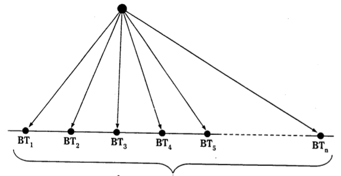
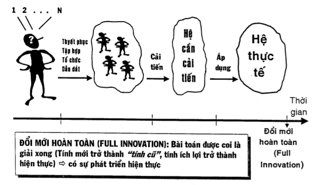

Một số khái niệm cơ bản
=======================
Phương pháp luận (Methodology)
------------------------------
Phương pháp luận (Methodology) thường được hiểu theo hai nghĩa:
  1. Khoa học hoặc lý thuyết về phương pháp
  2. Hệ thống các phương pháp

Trong giáo trình này, thuật ngữ "phương pháp luận" được hiểu theo nghĩa thứ hai: __hệ thống các phương pháp__.

Sáng tạo (Creativity)
---------------------
Sáng tạo (Creativity) là hoạt động tạo ra bất kì cái gì có đồng thời _tính mới_ và _tính lợi ích_.

  * "Tính mới" là sự khác biệt của đối tượng cho trước so với đối tượng cùng loại ra đời trước đó về mặt thời gian (đối tượng tiền thân).
  * "Tính ích lợi" chỉ thể hiện ra khi đối tượng cho trước hoạt động (làm việc) theo đúng chức năng và __phạm vi áp dụng__ của nó.
  * Khái niệm "phạm vi áp dụng" có xuất xứ từ luận điểm triết học "chân lý là cụ thể": một kết luận (hiểu theo nghĩa rộng) là đúng (chân lý) chỉ trong không gian, thời gian, hoàn cảnh, điều kiện... cụ thể (phạm vi áp dụng). Ở ngoài phạm vi áp dụng, kết luận đó không còn đúng nữa (xem [Hình 1](pvad.md)). Tương tự với chân lý, tính ích lợi cũng có phạm vi áp dụng: đối tượng cho trước hoạt động ở ngoài phạm vi áp dụng, lợi có thể biến thành hại.
  * Sáng tạo đòi hỏi "có đồng thời" tính mới và tính ích lợi. Nói cách khác, tính mới phải đem lại ích lợi thặng dư so với trước đó.
  * Cụm từ "bất kì cái gì" nói lên rằng, sáng tạo có mặt ở bất cứ lĩnh vực nào trong thế giới vật chất và thế giới tinh thần.
  * Để đánh giá một đối tượng cho trước có phải là sáng tạo không, người ta có thể sử dụng chương trình gồm năm bước sau:
    1. Chọn đối tượng tiền thân
    2. So sánh đối tượng cho trước với đối tượng tiền thân
    3. Tìm "tính mới" của đối tượng cho trước
    4. Trả lời câu hỏi "Tính mới đó đem lại ích lợi gì? Trong phạm vi áp dụng nào?"
    5. Kết luận theo định nghĩa sáng tạo.
  * Sáng tạo có nhiều mức, từ một, đến năm là cao nhất (sẽ trình bày ở Chương 2).
  
Vấn đề - bài toán (Problem)
---------------------------
Vấn đề - bài toán (Problem) là tình huống, ở đó người giải biết mục đích cần đạt nhưng:

    1. không biết cách đạt đến mục đích, hoặc
    2. không biết cách tối ưu đạt đến mục đích trong một số cách đã biết.

  * Trường hợp thứ hai chính là quá trình ra quyết định.
  * Hai trường hợp trên có thể chuyển hoá lẫn nhau.
  * Các bài toán có thể được phân loại theo các cách khác nhau và được đặt tên để phân biệt. Trc hết, chúng ta làm quen với hai loại bài toán với các tên gọi tương ứng:
    1. Bài toán cụ thể được phát biểu đúng hay gọi tắt là bài toán đúng.
    2. Tình huống vấn đề xuất phát.
  
Bài toán đúng có hai phần: giả thiết và kết luận. Phần giả thiết trình bày những các cho trước, đủ để giải bài toán. Phần kết luận chỉ ra đúng mục đích cần đạt một cách cụ thể. Giải bài toán đúng là quá trình suy nghĩ đi từ giả thiết đến kết luận. Cần phải nói ngay, các bài toán do thầy. cô cho trong cấc trường học. Do vậy, các bài toán đúng còn được gọi là các bài toán giáo khoa hay cóc bài toán sách vở (ý nói xa rời thực tế).

Những bài toán chúng ta gặp trong thực tế chưa phải là bài toán đúng. Chúng có tên gọi các tình huống vấn đề xuất phát: người giải phải tự phát biểu bài toán; phần giả thiết có thể thiếu hoặc thừa hoặc là vừa thừa vừa thiếu; phần kết luận nêu mục đích chung chung, không rõ ràng, không chỉ ra cụ thể đi tìm cái gì.

Để có bài toán cụ thể đúng cần giải, thông thường phải thực hiện các giai đoạn sau:

  1. Phát hiện các tình huống vấn đề xuất phát có thể có.

  2. Lựa chọn tình huống vấn đề xuất phát ưu tiên đề giải quyết.

  3. Phát hiện và phát biểu phổ các bài toán cụ thể có thể có của tình huống vấn đề xuất phát ưu tiên (Xem Hình 2) .

  4. Phân tích, đánh giá và lựa chọn trong sổ các bài toán cụ thể kể trên ra bài toán cụ thể đúng cần giải.

__Phổ các bài toán cụ thể có thể có__

Rất tiếc, quá trình đi từ tình huống vấn đề xuất phát đến bài toán cụ thể đúng cần giải rất ít được để cập trong các trường học.

Từ những gì trình bày ở trên, chúng ta cần thay đổi cách xử sự thường gặp:

Vừa phát hiện ra một bài toán cụ thể đã lao vào giải ngay. Thay vào đó, chúng ta cần thực hiện bốn bước nêu trên để có được bài toán cụ thể đúng cần giải.

* Các bài toán còn có thể được phân loại theo các tiêu chuẩn khác nữa, sẽ được trình bày trong những phần sau của giáo trình.

* Bài toán có thể là của cá nhân, tập thể, quốc gia, toàn cầu thậm chỉ có thể là vũ trụ nữa

* Bài toán có thể nảy sinh ở bất kỳ lĩnh vực nào, bất kỳ lúc nào, với bất kỳ ai.

* Cuộc đời của mỗi người là chuỗi các vấn đề cần giải quyết, chuỗi các quyết định cần phải ra.

* Các bài toán có thể khác nhau ở mức độ khó. Mức khó của bài toán cũng chia thành năm mức, tương ứng với năm mức sáng tạo (Sẽ trình bày trong Chương 2)

* Người ta chỉ thực sự suy nghĩ khi gặp vấn đề cần phải giải quyết hoặc/và khi cần phải ra quyết định.

Tư duy sáng tạo (Creative Thinking)
-----------------------------------
là quá trình Suy nghĩ đưa người giải

1. từ không biết cách đạt đến mục đích đến biết cách đạt đến mục đích, hoặc
2. từ không biết cách tối ưu đạt đến mục đích đến biết cách tối ưu đạt đến mục đích trong một số cách đã biết

  * Tư duy sáng tạo và quá trình suy nghĩ giải quyết vấn đề và ra quyết định được coi là tương đương về nghĩa.

Đổi mới (Innovation)
--------------------
là quá trình thực hiện tạo ra cái mới sao cho hệ liên quan tiếp nhận cái mới đó một cách đẩy đủ, ổn định và bền vững để hệ liên quan hoạt
động tốt hơn trước.

* Khái niệm "đổi mới" giống khái niệm sáng tạo ở chỗ nó có đồng thời tính mới và tính ích lợi. Tuy vậy, nó được tách ra thành khái niệm riêng để nhấn mạnh "quá trình thực hiện" và "sự tiếp nhận".

* Quá trình thực hiện gốm các giai đoạn sau:

    A. Xác định bài toán cần giải (Xác định tình huống vấn đề xuất phát ưu tiên).

    B. Xác định Cách tiếp cận giải bài toán (xác dinh bài toán Cụ
    thể đúng Cần giải).
    
    C. Tìm thông tin giải bài toán.

    Việc tìm thông tin nhằm mục đích giải bài toán thường được thực hiện theo hai hướng:

     1. Kế thừa những gì đã biết liên quan đến bài toán, về mặt nguyên tắc, trong phạm vi toàn thế giới. Đây chính là việc thu thập thông tin thông qua việc đọc những tài liệu đã công bố, hỏi ý kiến các chuyên gia...
     2. Bản thân người giải bài toán phải tiến hành các cuộc điều tra, khảo sát, làm thí nghiệm nghiên cứu... mới có các thông tin cần thiết để giải bài toán.

    D. Tìm ý tưởng giải bài toán.
    
    E. Phát: triển ý tưởng thành thành phẩm.
    
    G. Áp dụng thành phẩm vào thực tế (theo nghĩa rộng).

Việc chia quá trình thực hiện thành 6 giai đoạn tuần tự như ở trên không nên hiểu một cách cứng nhắc. Trên thực tế, những người thực hiện có thể quay trở lại những giai đoạn đã trải qua vì lý do này hay lý do khác.

* Hình 3 mô tả một cách tóm tắt quá trình thực hiện.

Quá trình thực hiện gồm cả tư duy và hành động, trong đó các nguồn lực như chân, tay, tri thức, năng lượng, máy móc, vốn  được sử dụng.

__Đổi mới hoàn toàn (Full Innovation): Bài toán được coi là giải xong (Tính mới trở thành “tính cũ”, tính ích lợi trở thành hiện thực) => có sự phát triển hiện thực__

* Về mặt nguyên tắc, các kết quả của mỗi giai đoạn thực hiện cần được hệ thống liên quan tiếp nhận một cách đầy đủ (một trăm phần trăm), ổn định (các đối tượng được tiếp nhận phải hoạt động ổn định) và bền vững (các đối tượng được tiếp nhận không làm nảy sinh những vấn đề mới đối với các hệ tiếp nhận chúng).

* Khái niệm đổi mới đòi hỏi những người thực hiện phải đưa ra quyết định, một mặt, phù hợp với mục đích của mình, mặt khác, được tiếp nhận một cách đầy đủ, ổn định và bền vững.

* Bài toán cho trước chỉ được coi là giải xong khi hệ thực tế (tất cả các đối tượng tiềm ẩn cần sử dụng thành phẩm) tiếp nhận thành phẩm đó một cách đầy đủ, ổn định và bền vững. Làm được như vậy, chúng ta có __đổi mới hoàn toàn__ đối với bài toán cho trước.

* Khi đạt được đổi mới hoàn toàn, tính mới trở thành tính cũ, còn tính ích lợi trở thành hiện thực trong hệ thực tế. Nói cách khác, đạt được đổi mới hoàn toàn chúng ta mới có sự phát triển hiện thực, đẩy đủ, ổn định và bền vững, do vậy,
mới thực sự nâng cao chất lượng cuộc sống của từng người và toàn nhân loại.

* Khái niệm đổi mới hoàn toàn còn cho thấy một khả năng quan trọng: có thể bạn không phải là tác giả hoặc người sản xuất ra thành phẩm. Nhưng nếu như bạn thực hiện được giai đoạn cuối cùng (giai đoạn G) trước họ, hệ thực tế của bạn phát triển trước họ.

* Khái niệm đổi mới hoàn toàn còn có công dụng định hướng tư duy và hành động ngay từ đầu và trong suốt quá trình thưc hiện về phía đưa ra những giải pháp mà hệ thực tế thực sự cần chứ không phải đưa ra những giải pháp không được hệ thực tế tiếp nhận. Điều này có nghĩa, người giải, trong quá trình xác định bài toán cần giải, phải tìm hiểu, tính đến các đặc thù và quy mô của hệ thực tế, nơi lời giải sẽ đưa ra áp dụng trong tương lai. Trong một số trường hợp, chính việc tìm hiểu các đặc thù và quy mô của hệ thực tế quyết định xem bài toán cho trước có cần ưu tiên giải hay không.

