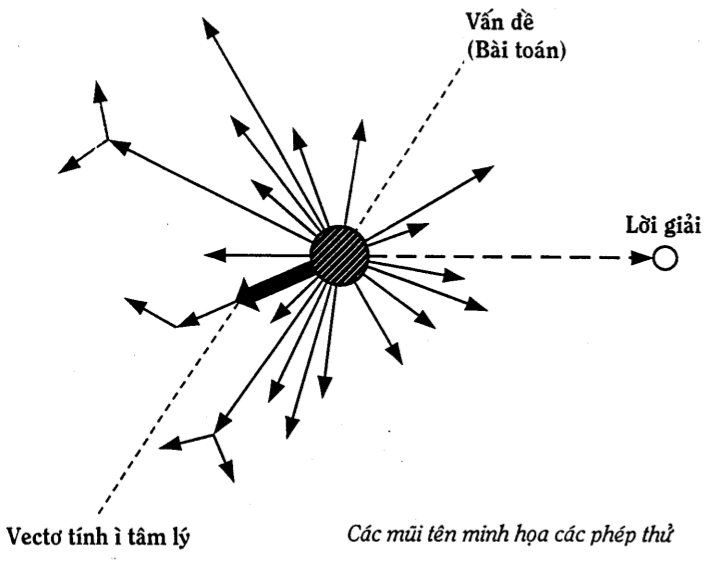

Phương pháp thử và sai
======================
* Thực tế cho thấy, đa số mọi người suy nghĩ một cách tự nhiên để giải quyết vấn đề và ra quyết định. Sự tự nhiên này thể hiện ở chỗ, người suy nghĩ hiếm khi suy nghĩ về cách suy nghĩ của chính mình, cũng giống như người ta hít thở, đi lại  một cách tự nhiên mà ít khi suy nghĩ về chúng và tìm cách cải tiến chúng.
* Nghiên cứu và làm các thí nghiệm về tư duy sáng tạo, các nhà tâm lý nhận thấy, phẩn lớn mọi người khi có vấn đề thường nghĩ ngay đến việc áp dụng các ý tưởng sẵn có trong trí nhớ. Sau khi phát hiện ra những "phép thử" đó sai, người giải tiến hành các phép thử khác. Kiến thức và kinh nghiệm riêng của người giải luôn luôn có khuynh hướng đưa người giải đi theo con đường mòn đã hình thành trong quá khứ. Nếu các "phép thử" đó lại "Sai", người giải trở nên mất tự tin và các phép thử tiếp theo, nhiều khi, mang tính chất hú họa, mò mẫm. Thông thường, người giải phải tốn khá nhiều "phép thử - sai" (bài toán càng khó, số lượng này càng lớn) để cuối cùng may mắn có một phép thử là lời giải đúng.
(Xem Hình 4).

Hình 4

* Cách suy nghĩ tự nhiên nói trên được gọi là phương pháp thử và sai.
* Phương pháp thử và sai còn được gọi là phương pháp tự nhiên vì nó đã có sẵn trong tự nhiên, được các loài sinh vật dùng để giải quyết các vấn đề của chúng.
