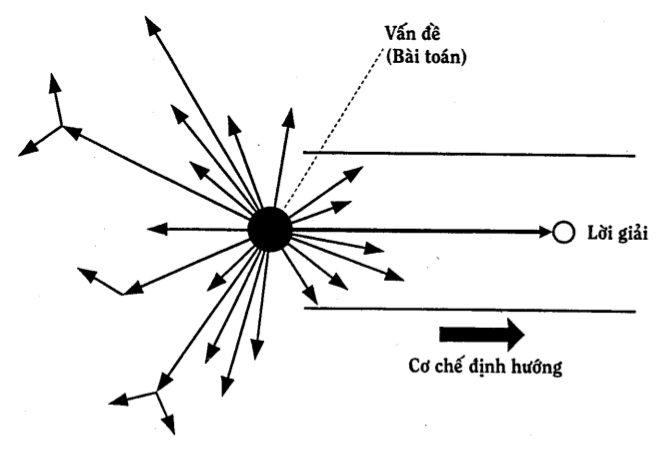
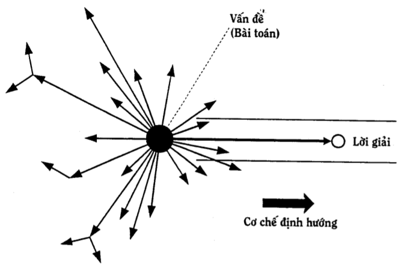

Các ưu và nhược điểm của phương pháp thử và sai.
===============================================
Ưu điểm
-------
* Ta quy ước gọi alpha =
(Tổng số các phép thử có thể có của bài toán cho trước) / (Tổng số các lời giải có thể có của bài toán cho trước)
* Phương pháp thử và sai hoàn toàn thích hợp đổi với loại bài toán, ở đó alpha nhỏ,
khoảng vài đơn vị (nói chung alpha < 10) và trả giá cho mỗi phép thử - sai không
đáng kể hoặc chấp nhận được.

* Phương pháp thử và sai cũng hoàn toàn thích hợp đối với loại bài toán có alpha lớn, ở đó có công cụ thực hiện các phép thử rất nhanh và trả giá cho mỗi phép thử - sai không đáng kể hoặc chấp nhận được. Ví dụ, những bài toán có thể giải được nhờ tốc độ cao của máy tính.
* Ưu điểm lớn nhất của phương pháp thử và sai: nó chính là cơ chế của sự tiến hóa và phát triển trong tự nhiên, xã hội và tư duy cho đến thời gian gần đây.

Nhược điểm:
-----------
Dưới đây liệt kê một số nhược điểm của phương pháp thử và sai.

1. Lãng phí lớn
2. Tính ì tâm lý có ảnh hưởng xấu
3. Các tiêu chuẩn đánh giá "đúng“, "sai" mang tính chủ quan và ngắn hạn.
4. Năng suất phát ý tưởng thấp
5. Thiếu cơ chế định hướng tư duy về phía lời giải
  * Nhược điểm thứ năm là nhược điểm cơ bản nhất của phương pháp thử và sai (xem Hình 5 và Hình 6).
  * Sau này, chúng ta còn thấy thêm nhiều nhược điểm khác nữa của phương pháp thử và sai.

