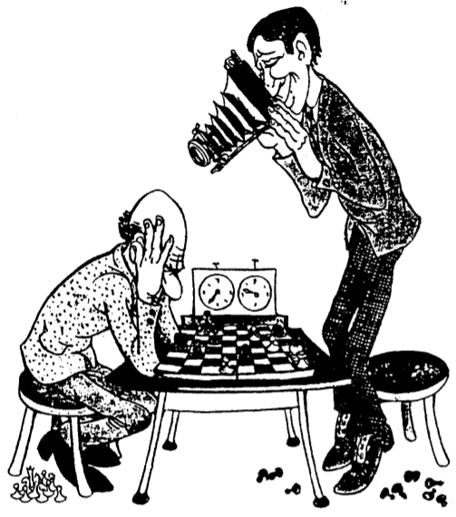

Tổng quan các cách tiếp cận trong lĩnh vực PPLST
================================================
Các nhược điểm của phương pháp thử và sai càng ngày càng bộc lộ rõ. Nó không đáp ứng được các đòi hỏi của sự phát triển và không thích hợp để giải quyết các vấn đề hiện đại. Trong lĩnh vực sáng tạo và đổi mới, nhiều nhà nghiên cứu đã xây dựng các phương pháp, phương pháp luận nhằm cải tiến, cao hơn nữa, thay thế phương pháp thử và sai.

Hiện nay trên thế giới có khá nhiều phương pháp, phương pháp luận sáng tạo như vậy, được xây dựng dựa trên những cách tiếp cận khác nhau. Một cách gần đúng, có thể chia các cách tiếp cận này thành bốn loại:

  1. Cách tiếp cận thuần túy tâm lý (Xem Hình 7). Ví dụ như phương pháp não công (Brainstorming) cổ điển, sẽ trình bày trong Chương 5.
  2. Cách tiếp cận kết hợp tâm lý với một số kinh nghiệm mang tính khái quát của những người có thành tích sáng tạo tốt (ví dụ như phương pháp đối tượng tiêu điểm, sẽ trình bày trong Chương 5).
  3. Cách tiếp cận nhằm bao quát tất cả các phép thử có thể có để từ đó có thể tìm ra tất cả các lời giải có thể có (ví dụ như phương pháp phân tích hình thái, sẽ trình bày ở Chương 5).
  4. Cách tiếp cận dựa trên các quy luật phát triển hệ thống nhằm xây dựng cơ chế định hướng trong tư duy sáng tạo (nhằm khắc phục nhược điểm cơ bản nhất của phương pháp thử và sai) như Lý thuyết giải các bài toán sáng chế, viết tắt theo tiếng Nga và chuyển sang ký tự Latinh là TRIZ. Tác giả của TRIZ là ông Gemrikh Saulovich Altshuller (1926 - 1998), nhà sáng chế, đồng thời là nhà văn viết truyện khoa học viễn tưởng người Nga.

Phần còn lại của Chương 2 giới thiệu tổng quan về TRIZ và Phụ lục 2 tập hợp một số thông tin về các hoạt động liên quan đến TRIZ trên thế giới.

Tiếng Nga: 
Chuyển sang ký tự La tinh: T R I Z
Tiếng việt: LÝ THUYẾT GIẢI CÁC BÀI TOÁN SÁNG CHẾ
Tiếng Anh: THEORY OF INVENTIVE PROBLEM SOLVING (TIPS)

Gemrikh Saulovich Altshuller, Father of TRIZ,
15 October 1926 - 24 September 1998

